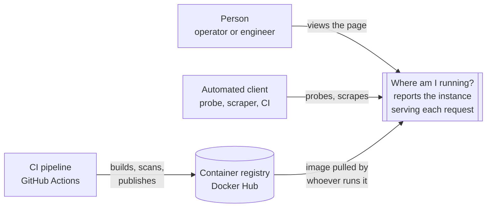
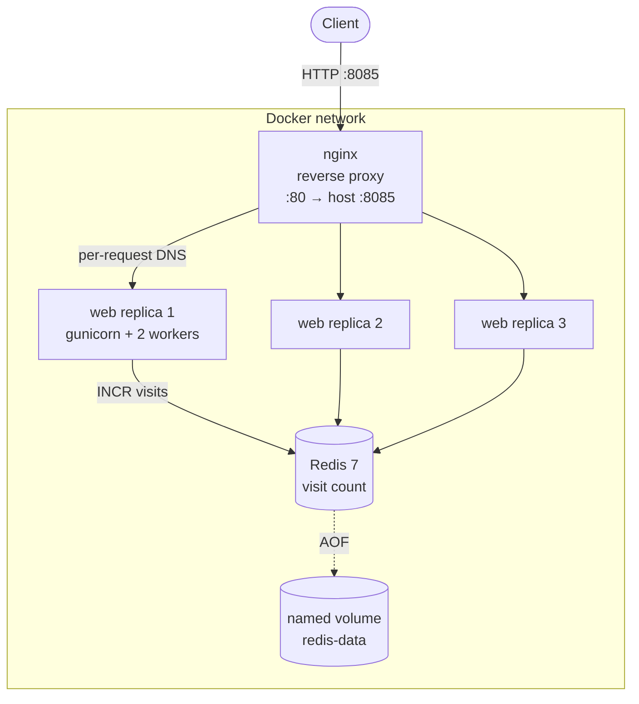
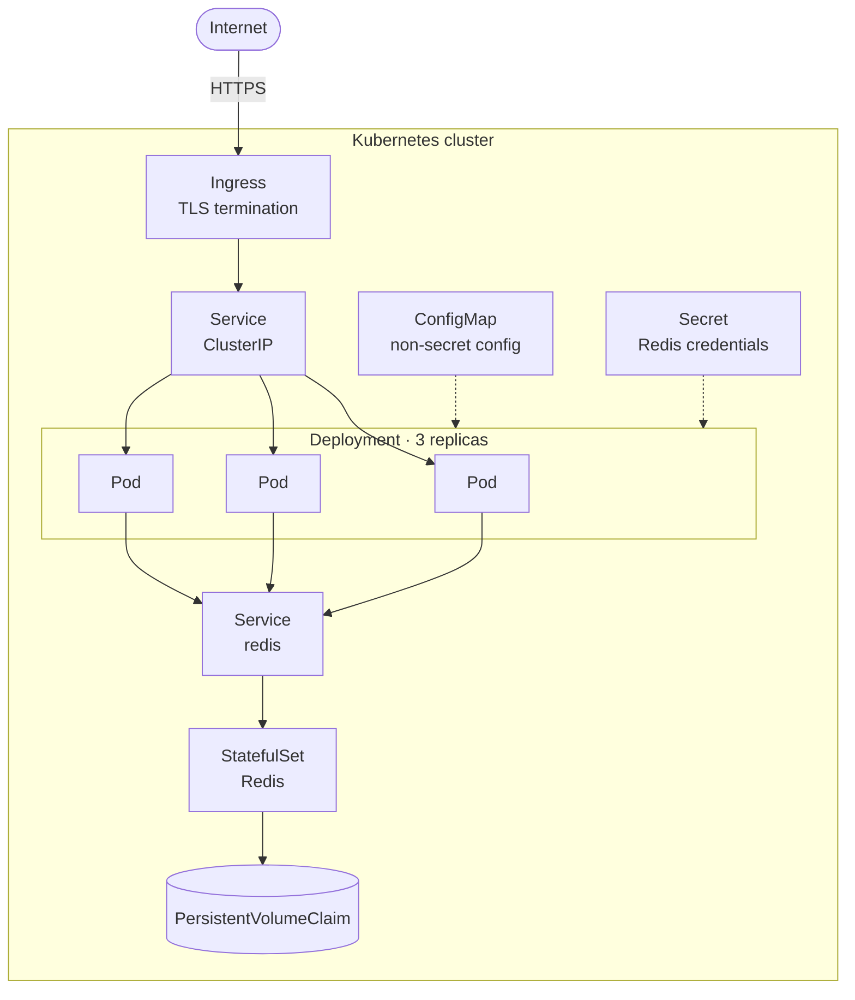

# Architecture

**System:** Where am I running?
**Status:** §1–§6 describe what is built and running. §7 describes the intended
Kubernetes deployment and **is not implemented**.

---

## 1. Context

The system has no upstream callers and no downstream services beyond its own
data store. It exists to be observed.

## 2. Quality attributes

The attributes that drove the structure, and the mechanism that delivers each:

| Attribute | Mechanism |
| --- | --- |
| **Observability** | Every instance reports its own identity, build and limits; metrics at `/metrics` |
| **Availability** | Dependencies degrade features, never requests; probes never fail on a dependency |
| **Portability** | All config from the environment; one image, multi-architecture, cgroup v1 and v2 |
| **Deployability** | Graceful drain, readiness gating, immutable images tagged by commit |
| **Security** | Non-root, minimal runtime image, scanned every build, SBOM and provenance attached |
| **Testability** | Application factory, injected cgroup root, no live dependency in any test |

## 3. Container view

Only the proxy publishes a host port. The replicas are reachable solely inside
the network, which is both the conventional arrangement and the reason scaling
requires no port bookkeeping.

## 4. Deployment views

Three topologies exist today, and the same image serves all of them.

| Topology | Command | Shape | Used for |
| --- | --- | --- | --- |
| **Single container** | `docker run` | One instance, in-memory counter | Quick checks; observing cgroup limits and drain behaviour |
| **Compose stack** | `docker compose up --scale web=3` | Proxy + N replicas + Redis + volume | Development, and observing load balancing and shared state |
| **CI** | GitHub Actions | Ephemeral stack, asserted, torn down | Verification |

## 5. Decisions

Each of these was a fork in the road. The reasoning matters more than the
choice, because the reasoning is what transfers.

### D-1 · Configuration exclusively from the environment

*Every value that differs between deployments arrives as an environment
variable with a working default.*

The alternative — configuration files per environment, or values baked at build
time — produces a different image per environment, and then "it works in
staging" stops being evidence about production. One image that runs everywhere
means the artifact you tested is the artifact you shipped.

### D-2 · Multi-stage image build

*Dependencies are installed in a builder stage; the runtime stage copies only
the installed tree.*

The build toolchain, pip's caches and the wheel archives are all attack surface
and all useless at runtime. Splitting the stages removes them without any
`rm -rf` gymnastics, and keeps the runtime image at roughly 136 MB.

### D-3 · gunicorn, not the Flask development server

The development server is single-threaded, does not drain on shutdown, and says
so on startup. Serving production traffic from it is the most common
containerisation mistake there is.

### D-4 · `exec` in the container command

*`CMD ["sh", "-c", "exec gunicorn …"]`.*

Without `exec`, the shell stays PID 1 and does not forward signals to its
children. `SIGTERM` from `docker stop` would be swallowed, the grace period
would elapse in silence, and the container would be `SIGKILL`ed mid-request —
on every single deploy. One word, and it is the difference between a deploy
nobody notices and one that drops requests.

### D-5 · nginx resolves upstreams per request

*`proxy_pass` targets a variable, with `resolver 127.0.0.11` declared.*

Open-source nginx resolves a literal upstream address exactly once, at startup,
and pins the single IP it receives for the life of the process. With a scaled
service that means every request lands on the same replica while the
configuration looks perfectly correct. Pointing `proxy_pass` at a variable
defers resolution to request time, so Docker's DNS — which rotates the A records
for a scaled service — actually balances the load. Verified: 12 requests split
4 / 4 / 4 across three replicas.

### D-6 · Shared state lives outside the process

*The visit count is `INCR`d in Redis when one is configured.*

Instances must be interchangeable and disposable. Anything held in a process
belongs to that process, and the in-memory fallback is retained deliberately so
the difference can be observed rather than asserted.

### D-7 · Liveness and readiness are separate, and neither checks Redis

Liveness answers "restart me"; readiness answers "stop sending me traffic". A
dependency check in a liveness probe turns an outage into a restart loop; a
dependency check in a readiness probe empties the load balancer of every
healthy replica at once. Both convert the loss of a feature into the loss of the
system. What *does* fail readiness is a shutdown marker, so an instance can
leave the load balancer before it stops listening.

### D-8 · Metrics aggregate across workers

*Workers mirror counters into a shared directory; the endpoint sums them.*

Python needs multiple processes to use multiple cores, and each holds its own
counters. Without aggregation a scrape reports whichever worker answered, and
the graphs are noise. This costs a directory that must be cleared at startup and
a hook that retires dead workers — the price of the process model, paid
explicitly.

### D-9 · Scan before push, on a single architecture

*The pipeline builds one architecture locally, scans it, then builds and pushes
both.*

A scanner cannot read a multi-architecture manifest, nor an image that exists
only in a registry. Scanning after pushing means the vulnerable image is already
public. The layer cache makes the second build nearly free. `ignore-unfixed` is
set because a base image always carries some distro CVEs with no fix released,
and failing on those trains everyone to ignore the gate.

### D-10 · The stack is tested, not just the code

*A CI job starts the compose stack and asserts requests reach more than one
replica and the count is shared.*

No unit test loads `nginx.conf` or `docker-compose.yml`. Without this job, D-5
could silently regress — the demo would look like it worked, because the page
would still render.

## 6. Known weaknesses

Stated plainly, because a document that only lists strengths is marketing.

| Weakness | Consequence | Status |
| --- | --- | --- |
| **Redis has no password** | Anything on the network can read or change the count | Must fix before any non-laptop deployment |
| **No TLS anywhere** | All traffic, including to Redis, is plaintext | Must fix before exposure |
| Base images tracked by tag, not digest | A rebuild can silently pull different bytes | Fix during hardening |
| Dependencies pinned by version, not hash | Protects against drift, not against a compromised package | Fix during hardening |
| No resource requests or limits declared | A misbehaving replica can starve its neighbours | Fix during hardening |
| Plain-text logs | Not machine-parseable; cannot be queried by field | Planned |
| No dashboards or alerting | Metrics are published and nobody is watching | Planned |
| Drain and multi-worker metrics verified by hand | Could regress unnoticed | Gap in automation |
| No load test | The latency and startup targets in the SRS are unmeasured | Gap |

## 7. Target architecture — Kubernetes *(planned, not built)*

The intent is a single-node k3s cluster, run locally through k3d for
development and on a small VPS later. k3s was chosen precisely so that the
second step is a change of cluster, not a change of manifests.

**What maps onto what.** The concepts are the ones already built, renamed:

| Today | In Kubernetes |
| --- | --- |
| nginx proxy with per-request DNS | `Service`, which load balances by design |
| `--scale web=3` | `replicas: 3` on a Deployment |
| Named volume `redis-data` | `PersistentVolumeClaim` bound by a StatefulSet |
| Environment variables in compose | `ConfigMap` and `Secret` |
| Docker `HEALTHCHECK` | `livenessProbe` |
| *(nothing — this is new)* | `readinessProbe`, gating traffic per pod |
| `docker stop` grace period | `terminationGracePeriodSeconds` plus a `preStop` hook |

**What the move adds, that compose cannot do:**

- **Zero-downtime rolling updates.** The readiness endpoint and the shutdown
  marker exist precisely for this; a `preStop` hook writes the marker and waits
  for endpoint propagation before `SIGTERM`.
- **Self-healing.** A deleted pod is replaced without intervention.
- **Declared resources.** Requests and limits become scheduling input rather
  than a runtime flag.
- **Autoscaling.** A HorizontalPodAutoscaler driven by the metrics already
  published.
- **Real secret handling.** The Redis password can exist without being written
  into a file in the repository.

**Hardening to be applied at the same time:** `runAsNonRoot`,
`readOnlyRootFilesystem` (with an `emptyDir` for the metrics directory and the
readiness marker), all capabilities dropped, `allowPrivilegeEscalation: false`,
a seccomp profile, a PodDisruptionBudget, and base images pinned by digest.
