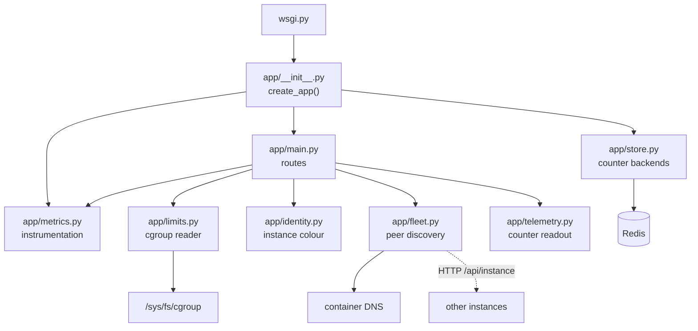
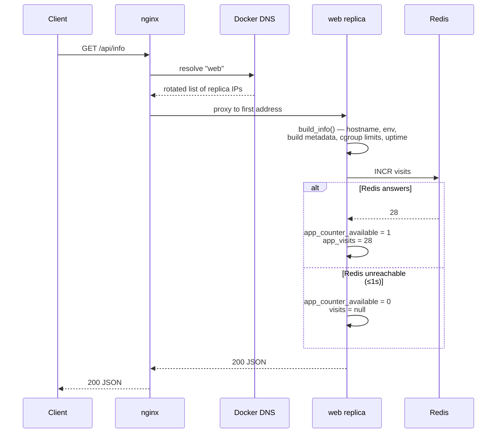
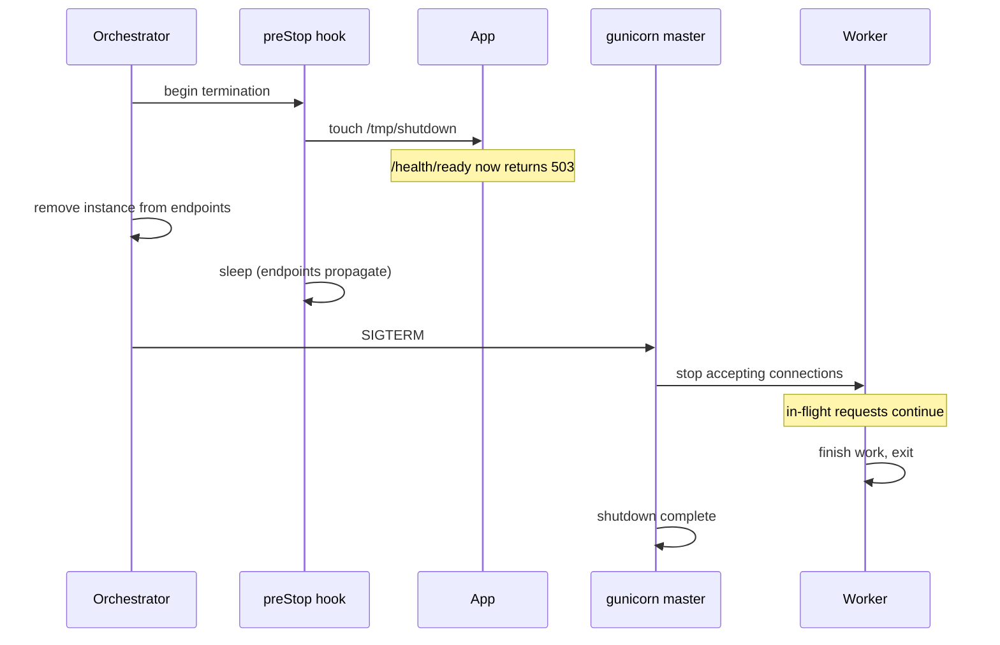

# System Design

**System:** Where am I running?
**Scope:** how the software is put together and how it behaves — components,
interfaces, control flow, concurrency, and what happens when things fail.

For *why* the structure is this shape, see `docs/architecture.md`. For what it
is required to do, see `docs/srs.md`.

---

## 1. Component overview

The application is five small modules, each with one job. Nothing is large
enough to need internal structure, and that is deliberate: every module should
be readable in one sitting.

| Module | Lines | Responsibility | Depends on |
| --- | --- | --- | --- |
| `app/__init__.py` | 20 | Application factory: build the app, choose the counter, install metrics | `store`, `metrics`, `main` |
| `app/main.py` | 116 | The routes, and assembling the information payload | `limits`, `metrics`, `identity` |
| `app/store.py` | 72 | The visit counter and its two backends | `redis` |
| `app/limits.py` | 73 | Reading cgroup limits from the kernel | — |
| `app/metrics.py` | 95 | Prometheus instrumentation and custom gauges | `prometheus_client` |
| `app/identity.py` | 45 | Derives a stable palette slot from an instance's name | — |
| `app/fleet.py` | 78 | Resolves and polls the other instances | — |
| `app/telemetry.py` | 55 | Reads this instance's counters out of the metrics registry | `prometheus_client` |
| `wsgi.py` | 5 | The entry point gunicorn imports | `app` |
| `gunicorn.conf.py` | 53 | Server settings, and the metrics directory lifecycle | — |

### 1.1 Why an application factory

`create_app()` builds and returns a fresh app rather than a module-level global.
This is what lets a test construct an isolated instance with its own counter and
its own metrics registry; a global app would force every test to share mutable
state, and failures would depend on test ordering.

### 1.2 Dependency direction



Dependencies point one way, inward from the entry point. `limits.py` and
`identity.py` depend on nothing at all, which is why they are the easiest
modules to test.

### 1.3 Colour is assigned by the server

An instance's colour identifies it in the console: in the fleet list, on every
chart line, in the table, and in the footer of the page it served. The slot is
derived from the hostname, because nothing knows a container's id until it
exists and there is no registry to look it up in.

Two decisions matter here. It selects a **slot in a fixed validated palette**
rather than a raw hue: two instances hashing ten degrees apart would be
indistinguishable as adjacent lines, which is exactly where the colour has to
work. And `/api/fleet` **assigns the slots itself**, resolving collisions across
the whole fleet, so the browser never reimplements the derivation and the two
can never drift apart.

---

## 2. Interfaces

### 2.1 Inbound: HTTP

| Path | Purpose | Notes |
| --- | --- | --- |
| `/` | HTML page | Increments the visit count |
| `/api/info` | JSON payload | Increments the visit count |
| `/health`, `/health/live` | Liveness | Excluded from metrics; touches nothing |
| `/health/ready` | Readiness | Excluded from metrics; checks the marker file only |
| `/metrics` | Prometheus scrape | Excluded from its own metrics |
| `/api/slow?seconds=N` | Deliberate delay | `N` clamped to `[0, 30]`; non-numeric rejected with `400` |

### 2.2 Outbound: Redis

One command, `INCR visits`, issued through a connection pool created at startup.
Connect and read timeouts are set to 1 second each, so an unreachable Redis
costs a bounded delay rather than a hung worker.

### 2.3 Inbound: the kernel

`app/limits.py` reads the cgroup filesystem. It takes the root path as a
parameter rather than hardcoding `/sys/fs/cgroup`, which is what allows the
tests to point it at a directory of fixture files and cover both cgroup
versions without needing two machines.

| cgroup | Memory | CPU |
| --- | --- | --- |
| v2 | `memory.max` → `max` or bytes | `cpu.max` → `"<quota> <period>"` or `"max …"` |
| v1 | `memory/memory.limit_in_bytes` → bytes, with a huge sentinel for unlimited | `cpu/cpu.cfs_quota_us` ÷ `cpu.cfs_period_us`, `-1` for unlimited |

Every read is wrapped: a missing file, an unreadable file, or an unparseable
value all resolve to `unlimited`. The service is reporting a curiosity about
itself; it must never fail a request because the kernel laid out a directory
differently than expected.

---

## 3. Control flow

### 3.1 A page request



The DNS resolution step is the load balancing. It happens per request because
`proxy_pass` targets a variable; see `docs/architecture.md` §5 for why that
detail is load-bearing.

### 3.2 Shutdown



The gap between the marker appearing and `SIGTERM` arriving is the entire
point. Without it, the load balancer is still routing to an instance that has
already closed its listener, and a handful of requests fail on every deploy.

Observed with `docker stop -t 40`: `SIGTERM` at `:05`, an 8-second request
completed with `200` at `:12`, then `shutdown complete`. The stop returned after
7.4 seconds — it waited for the drain, not for the timeout.

*The preStop half is a Kubernetes concept and is not yet wired up; the readiness
endpoint that makes it work exists and is tested.*

---

## 4. Concurrency model

An instance is one gunicorn master and two synchronous workers, each single-
threaded. Two requests are served at a time per replica; three replicas serve
six.

This is a small number, and it is chosen rather than defaulted. Synchronous
workers are simple to reason about and correct under any workload; the cost is
that a slow request occupies a worker completely. `/api/slow` demonstrates
exactly that: two concurrent slow requests will block a replica entirely. For a
service whose responses are computed in microseconds, the trade is right, and
the alternative — async workers — would add a failure mode (a blocking call
stalling an entire event loop) for throughput this service does not need.

### 4.1 State per process

| State | Scope | Consequence |
| --- | --- | --- |
| `STARTED_AT` | Per worker | A replaced worker reports a fresh uptime |
| In-memory count | Per worker | Six independent counts across three replicas |
| Redis connection pool | Per worker | Created once at startup, reused |
| Metric values | Per worker | Mirrored to files and summed at scrape time |

The first two look like bugs and are not: they are the visible consequence of
keeping state in a process, which is the thing the service exists to make
visible.

---

## 5. Failure modes

| Failure | Detection | Response | Requests affected |
| --- | --- | --- | --- |
| Redis unreachable | `RedisError` on `INCR`, within 1s | Backend marked unavailable, `visits: null`, `app_counter_available` → 0 | None fail |
| Redis returns garbage | Exception on `INCR` | As above | None fail |
| cgroup files missing or malformed | `OSError` / `ValueError` | Report `unlimited` | None fail |
| Worker crashes | gunicorn master notices | Worker replaced; its metric files retired | In-flight on that worker |
| Instance OOM-killed | Kernel `SIGKILL` (exit 137) | Container restarts per policy | All on that instance |
| Instance wedged | Liveness probe fails | Instance restarted | All on that instance |
| Shutting down | Readiness probe returns 503 | Instance removed from the load balancer, kept running | None, if the grace period is respected |
| A replica dies | Proxy connect timeout of 2s | `proxy_next_upstream` retries the next replica | None, after a 2s delay |

The pattern throughout: **degrade a feature, never fail a request**. The only
failures that reach a client are ones where the instance genuinely cannot
serve.

### 5.1 The failure mode that is deliberately absent

Neither probe queries Redis. If they did, a Redis outage would fail readiness
on every replica simultaneously and the load balancer would empty itself —
converting the loss of a visit counter into the loss of the entire site. This
is the most common way a health check makes an outage worse, and avoiding it is
a design rule here, not an oversight.

---

## 6. Error handling and validation

There is one piece of client input in the entire service, `seconds` on
`/api/slow`, and it is handled explicitly:

```python
try:
    seconds = float(request.args.get("seconds", 1))
except ValueError:
    return jsonify({"error": "seconds must be a number"}), 400

seconds = max(0.0, min(seconds, MAX_SLEEP_SECONDS))
```

Reject what cannot be interpreted; clamp what can. An unbounded sleep would let
any caller occupy a worker for as long as they liked, which is a denial of
service in three characters of query string.

Everywhere else, errors come from the environment rather than from a caller,
and the rule is the same: catch narrowly, degrade explicitly, never let an
infrastructure surprise become a 500.

---

## 7. Testing strategy

29 tests, running in 0.35 seconds, requiring no network and no live Redis.

| Area | Approach |
| --- | --- |
| Routes | Flask test client against an isolated app instance |
| cgroup parsing | Fixture files in `tmp_path`, both cgroup versions, passed via the `cgroup_root` parameter |
| Counter backends | In-memory directly; Redis pointed at a dead port to prove degradation |
| Metrics | Scrape the endpoint and assert on the exposition text |
| Degradation | Inject a deliberately broken counter and assert the routes still answer |
| The stack | A CI job that starts compose with three replicas and asserts requests reach more than one, and the count is shared |

Two decisions worth noting. **No test waits.** The endpoint that sleeps for 30
seconds is verified by asserting on what the route asked to sleep for, not by
sitting through it — a suite that takes 30 seconds to prove a cap is a suite
nobody runs. And **no test needs a live dependency**, so the suite runs
identically on a laptop and on a CI runner with no services attached.

The gap: the stack test lives only in CI, and multi-worker metric aggregation
and shutdown draining are verified by hand rather than automatically.
